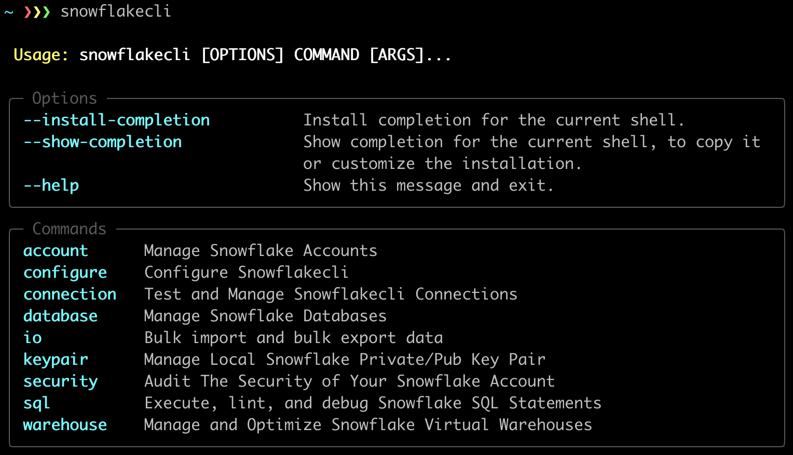

# What is Snowflakecli?

Snowflakecli is a [DuckDB](https://duckdb.org/)-powered, AI-augmented command line interface for [Snowflake](https://www.snowflake.com/en/).

It streamlines Snowflake **security**, **governance**, **operations**, and **cost optimization**.

# Installation

    $ pip install snowflakecli
    

# Who is Snowflakecli for?

**Snowflakecli is built for the following users:**

* Security threat-hunting teams still dealing with the [fallout of the UNC5537 breach](https://cloud.google.com/blog/topics/threat-intelligence/unc5537-snowflake-data-theft-extortion).
* Data and Ops teams looking to proactively improve and continuously monitor their security posture.
* Operations teams looking to optimize their [virtual warehouses](https://docs.snowflake.com/en/user-guide/warehouses)
* Data engineers looking to grasp the complexities of their Snowflake account

# What does Snowflakecli do?

**Snowflakecli currently incorporates:**

* Key-Pair utilities so you can ***establish and maintain secure access to your Snowflake account***.
* Customizable security threat hunting, with the [UNC5537](https://cloud.google.com/blog/topics/threat-intelligence/unc5537-snowflake-data-theft-extortion) threat hunt being the default.
* Customizable security and auditing benchmarks, with well-known industry standards being the default.
* CLI-based SQL execution
* Simplified SQL migration management - think a lightweight, Python-based [Flyway](https://www.red-gate.com/products/flyway/community/)
* Configuration management
* Connection management

**Snowflakecli is quickly expanding to include:**

* Data loading and unloading tools
* Snapshot your Snowflake account
* Declarative, idempotent resource management [with fewer dangerous surprises](https://github.com/Snowflake-Labs/terraform-provider-snowflake/issues?q=is%3Aopen+is%3Aissue+label%3Abug)
* ACL exploration - "Can user X access Y? How?"
* Virtual warehouse utilization and workload optimization tools
* AI-powered PII governance
* AI-powered account recommendations

# Why are we building it?

TODO

# Q&A

#### Can I contribute?

Yes! Please!

We are readily accepting new contributions and appreciate the power of collective knowledge and experience. If you have thoughts, ideas, suggestions, or innovative use cases please create an issue and let's start the conversation. Or just pull a PR 😀.

#### Is it secure?

Yes. The codebase is entirely open, MIT-licensed, and built with best-in-class Python tooling.

Unlike [other](https://docs.snowflake.com/en/user-guide/snowsql) [tools](https://docs.snowflake.com/en/developer-guide/snowflake-cli-v2/index) from Snowflake which facilitate insecure practices such as username and password-based authentication without MFA, Snowflakecli ***explicitly mandates key-pair authentication***. 

#### Does it help my Snowflake instance be more secure?

Yes. That is why it was built.

# License

[MIT](https://opensource.org/license/mit)
